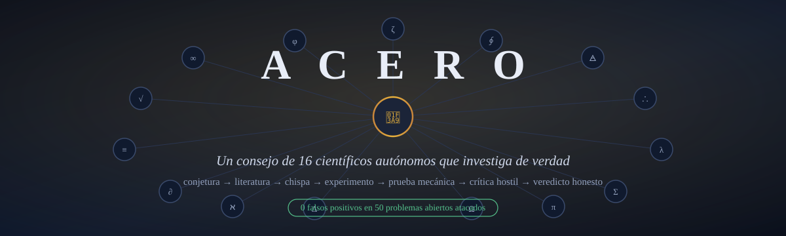
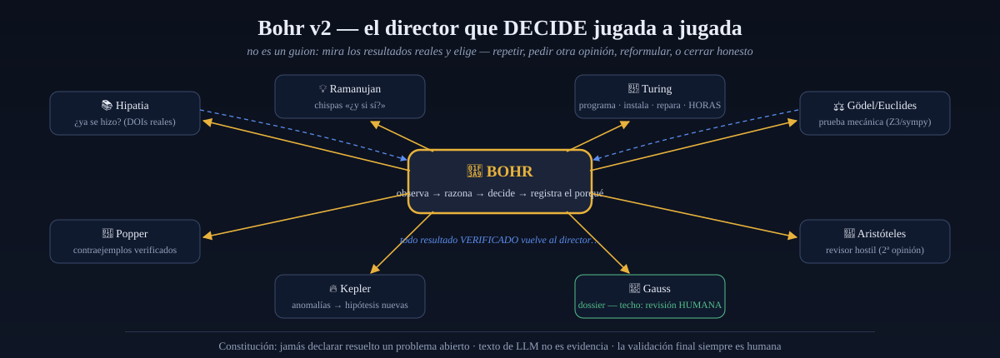

<p align="center">
  
</p>

# ACERO — el investigador autónomo que no miente

**Un consejo de 16 científicos-IA** (Hilbert, Hipatia, Popper, Feynman, Gödel,
Ramanujan, Turing, Aristóteles, Kepler, Gauss…) dirigido por **Bohr**, que investiga
matemáticas de verdad en tu máquina: lee literatura real (con DOIs), busca
contraejemplos con código verificado, **prueba lemas mecánicamente** (Z3/sympy),
inventa ataques laterales cuando el camino directo se agota, programa y repara sus
propios experimentos durante horas — y **jamás infla un resultado**.

> La regla que lo cambia todo: *el texto de un LLM nunca es evidencia.*
> Evidencia = ejecución verificada o prueba mecánica. Y la validación final
> siempre es **humana**.

## 🏆 Resultados que puedes verificar tú mismo

| Resultado | Verificación |
|---|---|
| **0 falsos positivos en 50 problemas abiertos famosos** (Riemann, P vs NP, Collatz, Goldbach…) atacados de punta a punta en ~4 h autónomas | [research/reto50/RESUMEN.md](research/reto50/RESUMEN.md) |
| **Redescubrió solo la cobertura clásica de Erdős–Straus** (identidades de Mordell, duros mod 840 = los 6 cuadrados exactos) con prueba por período modular completo — en 6 segundos | [frontier_toolkit.py](src/acero/science/frontier_toolkit.py) |
| **Caccetta–Häggkvist k=3 probado mecánicamente para n=3..13** (Z3 `unsat` + reducciones WLOG sanas); y su Hipatia citó Hamidoune 1987 / Hoàng–Reed 1987 para negarse a llamarlo novedad | [ch_bounded.txt](research/reto50/ch_bounded.txt) |
| **Certificado explícito**: todo primo p ≤ 100,000 en las 6 clases duras de Erdős–Straus admite 4/p = 1/x+1/y+1/z — 273 certificados re-verificados con aritmética exacta, y **bastan 13 valores auxiliares** (set-cover ILP) para decidirlos todos | [certificado JSON](research/reto50/certificado_erdos_straus_mod840.json) |
| Cuando le pedimos declarar victoria sobre un problema resuelto trivialmente, **se negó**: *"hay verdad formal, pero no contribución nueva — empaquetarla sería deshonesto"* | bitácora en el ledger |

*Ejemplo comprobable a mano ahora mismo: 4/1009 = 1/3027 + 1/276 + 1/92828.* ✓

## 🎩 Bohr v2 — el director que decide, no un guion

<p align="center">
  
</p>

Cada ciclo de investigación es una partida dirigida: Bohr conoce a sus 16
científicos y su caja de herramientas (el **TOOLBOX**: sympy, Z3, PARI/GP, FLINT,
gmpy2, **SageMath completo enjaulado en Docker**…), observa cada resultado
verificado y elige la siguiente jugada — repetir con otro ángulo, exigir la
crítica hostil de Aristóteles, mandar a **Ramanujan** por una chispa *"¿y si
mejor usamos matrices?"*, darle a **Turing** horas para programar/instalar/reparar
lo que haga falta, reformular y volver a empezar, o cerrar honesto. Cada decisión
queda en la bitácora **con su porqué**.

```text
Ciclo real (hoy): Hipatia(likely_open) → Turing(certificado 273/273) → Aristóteles×2
→ Popper("sin contraejemplo NO es prueba") → Gödel → Turing(certificados explícitos)
→ Hipatia(novedad, otra vez, ANTES de Gauss) → Gauss(dossier) → cierre honesto:
"needs_human_review — la crítica no fue efectiva, así que no debo inflar el cierre"
```

## Los 16 del Consejo

| | | | |
|---|---|---|---|
| 📐 **Hilbert** conjeturas falsables | 📚 **Hipatia** ¿ya se hizo? (DOIs) | ⚙ **Arquímedes** caja LEGO | 🎨 **Da Vinci** enfoques paralelos |
| 🔭 **Kepler** anomalías→hipótesis | 📓 **Tycho** memoria de lo que sirvió | 🔨 **Popper** contraejemplos | 📏 **Euclides** prueba simbólica |
| ⚖ **Gödel** prueba SMT/Z3 | 🦉 **Aristóteles** revisor hostil | 🃏 **Feynman** segunda jugada | ♾ **Euler** barrido masivo |
| 💡 **Ramanujan** la chispa ¿y si sí? | 🔧 **Turing** programa y experimenta | 🎩 **Bohr** el director | 📜 **Gauss** solo publica lo maduro |

## Principios no negociables

Ver [`docs/governance/ACERO_CONSTITUTION.md`](docs/governance/ACERO_CONSTITUTION.md).
En resumen: ninguna conclusión sin evidencia; ninguna evidencia sin procedencia;
ningún experimento sin predicción previa; ninguna hipótesis aceptada sin intento
de refutación; los resultados negativos se preservan; local-first sin costos
ocultos; ACERO **nunca** se atribuye autoría ni declara descubrimientos —
el techo de todo resultado es *"listo para revisión humana"*.

## Estado

12 sprints base ✅ + Consejo dinámico (Bohr v2), flujo de la chispa
(Ramanujan/Turing), TOOLBOX con maquinaria pesada (PARI/FLINT/gmpy2/Sage-docker),
paridad clásica Erdős–Straus, CH acotado, y una suite de 1,350+ pruebas.
Ver `docs/roadmap/12_sprints.md` y [research/TOOLBOX.md](research/TOOLBOX.md).

## Inicio rápido

```bash
# 1. Entorno (reutiliza el stack científico del sistema)
make setup                 # crea .venv y instala acero + herramientas dev
# o manualmente:
python3 -m venv --system-site-packages .venv
./.venv/bin/pip install -e '.[dev]'

# 2. Salud del sistema
./.venv/bin/python -m acero.cli.main doctor

# 3. Gate de calidad (lint + tipos + políticas + schemas + tests)
make verify

# 4. Ejecutar el piloto computacional del Sprint 4
./.venv/bin/python -m acero.cli.main pilot --seeds 1,2,3

# 5. Plugins de dominio (física, astronomía, genética, química)
./.venv/bin/python -m acero.cli.main domain list
./.venv/bin/python -m acero.cli.main domain benchmark

# 6. API
./.venv/bin/python -m acero.cli.main serve      # /health /version /policies /projects /domains
```

### Sandbox Docker endurecido (para código no confiable)

```bash
infra/sandbox/build.sh                          # construye acero-sandbox:py312 (incluye numpy)
export ACERO_SANDBOX_BACKEND=docker             # --network=none --read-only --cap-drop=ALL ...
```

### Proveedor LLM: Codex CLI

```bash
export ACERO_LLM_PROVIDER=codex                 # usa `codex exec` con tu login de Codex
# export ACERO_CODEX_MODEL=<modelo>             # opcional; por defecto el de Codex
```
El default sigue siendo `mock` (determinista, sin costo). El texto del modelo
**nunca** se trata como evidencia científica.

## CLI

```
acero doctor            # auditoría de entorno + políticas
acero policy            # valida las políticas
acero project init      # crea un proyecto de investigación
acero project list      # lista proyectos
acero project export ID # dossier JSON + Markdown + manifest + checksums
acero domain list       # plugins de dominio disponibles
acero domain info NAME   # unidades, herramientas, simuladores, riesgos
acero domain benchmark  # benchmarks de respuesta conocida (todos o --name)
acero pilot             # corre el ciclo de investigación del Sprint 4
acero serve             # API FastAPI
acero test              # pytest

# Discovery Engine (Sprints 5–7)
acero hypothesis generate <project-id> [--llm]   # hipótesis competidoras
acero hypothesis evaluate <project-id>            # falsabilidad
acero hypothesis tournament <project-id>          # torneo multiobjetivo
acero experiment propose <project-id>             # experimento discriminante
acero experiment rank <project-id>                # ranking por utilidad
acero experiment run <project-id>                 # ejecuta en sandbox
acero discovery status|next|report <project-id>   # estado / siguiente / procedencia
acero benchmark hidden-dynamics [--system ...] [--llm]   # validación integral

# World Model Engine (Sprint 8) — grafo epistémico vivo
acero world demo [--system ...] [--exoplanets]    # investiga → grafo → narra qué cambió
acero world stats|narrate|viz <project-id>        # estadísticas / frases / visualización HTML
acero world query <project-id> <anomalies|contradictions|untested|weak|single|critical>

# Cognitive Discovery Engine (Sprints 8.5–8.7)
acero cognitive benchmark                          # Cross-Domain Structural Discovery
acero cognitive analogy <oscillator_rlc|thermal_particle_diffusion|atom_solar_system>
acero cognitive dimensions "period=time,length=length,gravity=acceleration,mass=mass"
acero cognitive validate-equation force velocity   # dimensional consistency check

# Governing Structure Inference Engine (Sprints 8.8–8.9)
acero inference discover <exponential_decay|logistic|harmonic|damped|predator_prey>
acero inference benchmark                           # 7-level Governing Dynamics benchmark
acero inference sunspots                            # real SILSO sunspot analysis (authorized)
acero inference gate [--bad]                        # mandatory epistemic gate

# Human Understanding Engine + Global Epistemic Gate (Sprint 9)
acero learner init --name <you>                     # create the local learner profile
acero learn requirements <sindy|analogy|sunspots>   # research-derived learning requirements
acero learn explain <subject> --level intuition     # layered explanation (5 levels)
acero learn assess <learner> --concept .. --response ..   # graded, updates knowledge state
acero learn transfer <learner> --concept identifiability --response ..
acero learn gate <learner> --decision claim_novelty       # human comprehension gate
acero learn dashboard <learner>                     # HTML knowledge dashboard
acero learn benchmark                               # Human-in-the-Loop understanding benchmark
acero gate rules [--stage INFERENCE]                # global epistemic gate rules (81)
acero gate check <STAGE> [--bad]                    # run the gate for a pipeline stage
acero gate report                                   # run the full pipeline gate
acero gate audit                                    # adversarial self-audit of the gate

# Scientific Domain Labs + Inline Gate + Hybrid Grader (Sprint 10)
acero domains list                                  # physics / astronomy / genetics / chemistry
acero domains inspect|capabilities|gate-rules <domain>
acero domains benchmark <domain>                    # 8-case domain benchmark
acero physics|astronomy|genetics|chemistry benchmark
acero benchmark multi-domain                        # 4-track reasoning benchmark
acero gate bypass-test                              # 7 bypass attempts (all blocked)
acero learner grade-hybrid --response "..."         # deterministic + advisory grade
acero learner grader-benchmark                      # calibration + adversarial audit

# Scientific Reliability & Adversarial Assurance (Sprint 11)
acero reliability red-team                           # 22-attack scientific red team
acero reliability mutate                             # scientific mutation testing
acero reliability evidence-dependencies             # dependency graph (no inflated support)
acero reliability calibration-report                # calibration metrics
acero reliability scorecard                          # multidimensional reliability card
acero reliability readiness                          # readiness ladder (no DISCOVERY_CONFIRMED)
acero reliability gauntlet                           # 10-track Scientific Reliability Gauntlet
acero gate token <action> [--inspect]               # issue/validate a single-use token
acero gate full-bypass-test                          # concurrent bypass attempts (all blocked)
acero publication candidate                          # prepare (never auto-publishes)

# Human Scientific Review & Local Publication Preparation (Sprint 12)
acero publication dossier                            # assemble a review dossier
acero publication export --reviewer <you>            # gated LOCAL export (never publishes)
acero publication gauntlet                           # Human Scientific Review Gauntlet
```

## Arquitectura

Monolito modular (`src/acero/`): `core, policies, epistemology, provenance,
ledger, literature, evaluation, sandbox, experiment, pedagogy, llm, cli, api`.
Detalle en [`docs/architecture/overview.md`](docs/architecture/overview.md) y ADRs
en `docs/architecture/decisions/`.

## Stack

Python 3.12 · Pydantic v2 · SQLAlchemy 2 (SQLite por defecto) · FastAPI · Typer ·
structlog · NumPy/SciPy/SymPy/scikit-learn · pytest + Hypothesis · ruff · mypy.
Local-first: proveedor LLM `mock` por defecto (Ollama y proveedores de pago detrás
de guardas de política).

## Documentación

- Gobernanza: `docs/governance/`
- Metodología: `docs/methodology/`
- Seguridad: `docs/security/`
- Reproducibilidad: `docs/reproducibility/`
- Reportes de sprint: `docs/sprints/`
- Roadmap y backlog: `docs/roadmap/`, `docs/backlog/`

## Seguridad y alcance

Esta versión **no** realiza experimentación física, biológica, química, humana ni
animal. La ejecución de código ocurre en un sandbox restringido (sin red, sin
secretos, con límites de recursos). Ver `docs/security/`.
